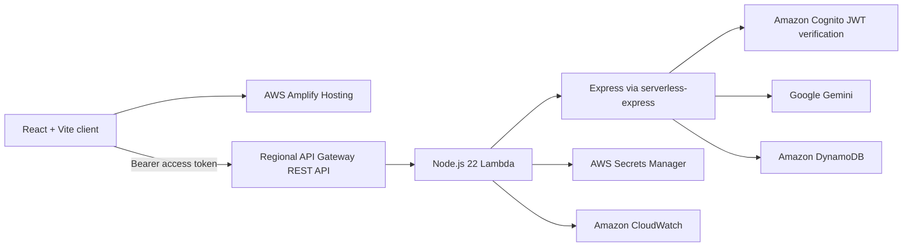

# InterviewAce AI

InterviewAce AI is a deployed mock-interview application that generates questions with Google Gemini, accepts typed or browser speech-to-text answers, evaluates completed interviews, stores results per Cognito user, and derives dashboard metrics from real DynamoDB history.

## Production status

The email/password and Google sign-in flows, question generation, interview session, evaluation, persistence, results view, and dashboard history flow are deployed and have been verified end to end. The current deployment uses AWS Amplify Hosting and an AWS SAM serverless backend in `ap-south-1`.

## Implemented features

- Cognito email/password registration, email confirmation, login, logout, and Google federation
- Centralized client authentication state and protected dashboard, creation, results, profile, settings, subscription, and help routes
- Accessible authenticated profile dropdown with account details, keyboard navigation, protected page links, and logout
- Functional account pages: Cognito display-name/password management, local interview/accessibility preferences, real beta usage, and in-app support guidance
- Configurable interview generation for role, experience, difficulty, domain, language, and position
- Ten Gemini-generated questions
- Typed answers and browser Web Speech API transcription with a 20-minute interview timer
- Structured Gemini evaluation with overall, communication, technical-knowledge, confidence, and per-question scores
- Score validation, retry/fallback handling, in-flight duplicate suppression, and retryable evaluation without clearing answers
- Completed-result persistence and paginated per-user DynamoDB history
- Searchable, filterable, sortable Interview History with incremental pagination and refresh-safe saved results
- Real dashboard totals, average/best score, streak, seven-day progress, recent interviews, and deterministic insights

## Screens and user flow

The implemented public routes are `/`, `/login`, `/signup`, and `/verify`. Authenticated application routes are `/dashboard`, `/create-interview`, `/results`, `/history`, `/history/:interviewId`, `/profile`, `/settings`, `/subscription`, and `/help`. Settings, paid subscription options, and support actions are explicitly Coming Soon placeholders. The `/interview` route carries generated questions in router state and is not currently wrapped by `ProtectedRoute`; its generate/evaluate API calls still require a valid Cognito access token.

```text
Landing -> sign up/sign in -> Dashboard -> Create Interview
        -> Generate Questions -> Answer Interview -> Evaluate and Save
        -> Results -> Dashboard history and metrics
```

Coding practice and behavioral-specific workflows are not implemented.

## Architecture



The same Express app is started by `server/src/server.ts` locally and adapted for Lambda by `server/src/lambda.ts` in production.

## Technology stack

| Area | Current implementation |
| --- | --- |
| Frontend | React 19, TypeScript, Vite 8, Tailwind CSS 4, React Router, Axios, AWS Amplify |
| Authentication | Amazon Cognito User Pool; email/password and Google OAuth |
| Backend | Node.js 22, Express 4, TypeScript, `@codegenie/serverless-express` |
| AI | Google Gemini through `@google/genai` 2.12.0 |
| Data | Amazon DynamoDB through AWS SDK v3 |
| Infrastructure | AWS SAM, Regional API Gateway REST API, Lambda arm64, Secrets Manager, CloudWatch |
| Hosting | AWS Amplify Hosting |

## Repository structure

```text
client/                 React/Vite frontend, dashboard logic, and client tests
server/src/             Express app, Lambda entry, auth, AI, and DynamoDB code
server/test/            Backend unit and adapter tests
docs/                   Technical and operational documentation
template.yaml           AWS SAM infrastructure definition
samconfig.toml.example  Non-secret SAM deployment defaults
amplify.yml             Amplify frontend build definition
DEPLOYMENT.md            Production deployment runbook
```

## Local setup

Requires Node.js 22+, npm, Cognito configuration, a Gemini API key, AWS credentials available through the standard AWS SDK credential chain, and the development DynamoDB table.

```bash
cd server
npm install
copy .env.example .env
npm run dev
```

In another terminal:

```bash
cd client
npm install
copy .env.example .env
npm run dev
```

The frontend runs at `http://localhost:5173`; the backend runs at `http://localhost:5000`, with API base `http://localhost:5000/api`. See [Local Development](docs/local-development.md).

## Environment variables

Server variables are defined in `server/.env.example`:

| Variable | Purpose |
| --- | --- |
| `NODE_ENV` | `development`, `test`, or `production` |
| `PORT` | Optional local port; defaults to `5000` |
| `AWS_REGION` | DynamoDB/Cognito AWS region |
| `DYNAMODB_INTERVIEWS_TABLE` | Environment-specific results table |
| `FRONTEND_URLS` | Comma-separated allowed origins |
| `COGNITO_USER_POOL_ID` | Cognito User Pool ID |
| `COGNITO_USER_POOL_CLIENT_ID` | Cognito app client ID |
| `GEMINI_API_KEY` | Local-only Gemini credential |
| `GEMINI_PRIMARY_MODEL` | Primary Gemini model |
| `GEMINI_FALLBACK_MODEL` | Fallback Gemini model |
| `GEMINI_REQUEST_TIMEOUT_MS` | Whole-operation AI deadline |

Lambda additionally receives `GEMINI_SECRET_ID`; it loads `GEMINI_API_KEY` from Secrets Manager during cold start. Client variables are `VITE_API_BASE_URL`, `VITE_AWS_REGION`, `VITE_COGNITO_USER_POOL_ID`, `VITE_COGNITO_USER_POOL_CLIENT_ID`, `VITE_COGNITO_DOMAIN`, `VITE_OAUTH_REDIRECT_SIGN_IN`, and `VITE_OAUTH_REDIRECT_SIGN_OUT`. Never commit populated `.env` files.

## Authentication

Amplify uses Cognito authorization-code OAuth with `openid email profile`. `AuthProvider` resolves the current session, constructs profile data from ID-token claims, handles OAuth completion, and reacts to Amplify auth events. Axios obtains the Cognito access token for each API request and attaches it as `Authorization: Bearer <token>`. The backend verifies access-token signature, issuer/user pool, client ID, expiry, and token use; persistence and history use the verified `sub`, never a client-supplied user ID.

## API summary

| Method | Path | Authentication | Purpose |
| --- | --- | --- | --- |
| `GET` | `/health` | No | Service health |
| `GET` | `/api/hello` | No | Simple welcome response (implemented, not used by the client) |
| `POST` | `/api/interview/generate` | Cognito access token | Generate questions |
| `POST` | `/api/interview/evaluate` | Cognito access token | Evaluate and save a result |
| `GET` | `/api/interview/history` | Cognito access token | Read paginated user history |
| `GET` | `/api/interview/history/:interviewId` | Cognito access token | Read one complete saved result |

See [API Reference](docs/api.md) for request/response contracts and errors.

## DynamoDB

- Development table: `InterviewAceInterviews-dev`
- Production table: `InterviewAceInterviews`
- Partition key: `userId` (String)
- Sort key: `interviewId` (String), formatted as `<ISO timestamp>#<UUID>`
- Writes: conditional `PutItem`
- History: descending `Query` and composite-key `GetItem` by authenticated user; no `Scan`

## AI reliability

The primary model is `gemini-3.5-flash` and the fallback is `gemini-3.5-flash-lite`. Each model has at most four attempts for retryable 503 responses and short-delay transient 429 responses, with capped exponential backoff and jitter inside one 24-second deadline. Daily quota responses fail immediately with 429. Evaluation JSON and every score are validated before persistence. See [AI Reliability](docs/ai-reliability.md).

## Deployment and production URLs

AWS SAM defines a Regional REST API, Node.js 22 arm64 Lambda (1024 MB, 60 seconds), 28-second proxy integration, structured CloudWatch logging, production-only DynamoDB permissions, and Gemini-secret read access. Amplify builds the Vite client from `client/`.

- Frontend: <https://main.d1aqwxz5mscjq8.amplifyapp.com>
- API invoke URL: <https://wbdxdn6su7.execute-api.ap-south-1.amazonaws.com/prod>
- Frontend API base: <https://wbdxdn6su7.execute-api.ap-south-1.amazonaws.com/prod/api>
- Region: `ap-south-1`

Deployment instructions are in [DEPLOYMENT.md](DEPLOYMENT.md).

## Security notes

Production does not store AWS access keys: Lambda uses its execution role. The Gemini key is read from `interviewace/gemini-api-key` in Secrets Manager (JSON key `GEMINI_API_KEY`). CORS permits the configured Amplify origin and does not use a wildcard. Logs intentionally avoid tokens, prompts, answers, and secret values. Application-level rate limiting is recommended but not currently implemented.

## Testing

```bash
cd server
npm test
npm run build

cd ../client
npm test
npm run lint
npm run build

cd ..
sam validate --lint --region ap-south-1
sam build
```

## Known limitations

- `/interview` itself is not protected by `ProtectedRoute`, though its API operations are authenticated.
- Behavioral can be selected in the form but uses the same generic generation/evaluation pipeline; there is no behavioral-specific mode.
- Generated questions, active interview state, and result navigation state are not persisted across browser refreshes.
- Speech input depends on browser Web Speech API support and per-origin microphone permission.
- Duplicate suppression is in-memory, per warm Lambda instance, and only covers concurrent identical requests.
- No application rate limiter, custom domain, advanced observability, or automated backend deployment pipeline.

## Planned next features

The repository does not implement these features yet: a coding interview platform, dedicated behavioral workflow, subscription billing, admin dashboard, custom domain, PDF reports, advanced monitoring, backend CI/CD automation, and asynchronous evaluation.

## Documentation

- [Architecture](docs/architecture.md)
- [Authentication](docs/authentication.md)
- [API](docs/api.md)
- [Database](docs/database.md)
- [AI Reliability](docs/ai-reliability.md)
- [Local Development](docs/local-development.md)
- [Deployment](DEPLOYMENT.md)
- [Security](docs/security.md)
- [Testing](docs/testing.md)
- [Troubleshooting](docs/troubleshooting.md)
- [Project Status](docs/project-status.md)
