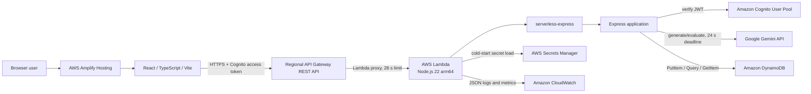

# Architecture

## High-level design

InterviewAce AI is a browser client plus a synchronous serverless API. AWS Amplify Hosting serves the compiled React application. The browser calls a Regional API Gateway REST API, which proxies requests to one Lambda function. `@codegenie/serverless-express` adapts API Gateway events to the same Express app used by the local Node.js server.

## Request flow

1. Amplify serves the Vite build and the browser initializes Amplify Auth.
2. Cognito authenticates the user with email/password or federated Google OAuth.
3. The Axios request interceptor obtains the current Cognito access token.
4. The client sends the request through API Gateway with `Authorization: Bearer <access-token>`.
5. API Gateway invokes `InterviewAceFunction` through its `/{proxy+}` Lambda proxy integration.
6. `server/src/lambda.ts` loads the Gemini secret before dynamically importing the Express app on a cold start, then caches the adapter for warm invocations.
7. Express applies CORS and JSON parsing. Interview routes verify the Cognito access token.
8. The controller uses the verified `sub` for deduplication and all user-owned data operations.
9. Generate requests call Gemini. Evaluate requests call Gemini, validate the response, and conditionally write a completed item to DynamoDB. History lists issue `Query`; saved-result detail requests issue a composite-key `GetItem`.
10. Lambda/API Gateway returns JSON to the browser; operational logs go to CloudWatch.

## Authentication flow

The browser uses Cognito's hosted OAuth flow with authorization code response type for Google, or Amplify's direct Cognito APIs for email/password. The API accepts Cognito access tokens, not ID tokens. `aws-jwt-verify` checks the configured User Pool, app client, `token_use=access`, signature, and expiry. The verified `sub` is the persistence partition key.

See [Authentication](authentication.md).

## Local and production environments

| Concern | Local | Production |
| --- | --- | --- |
| Frontend | Vite at `http://localhost:5173` | Amplify at the production origin |
| Backend entry | `server/src/server.ts`, Express listens on port 5000 | `server/src/lambda.ts`, Express adapter |
| API base | `http://localhost:5000/api` | API Gateway `/prod/api` |
| Data | `InterviewAceInterviews-dev` | `InterviewAceInterviews` |
| AWS identity | Local AWS credential chain | Lambda execution-role credentials |
| Gemini key | `server/.env` | Secrets Manager cold-start load |
| CORS | Localhost plus configured origins in development | Configured Amplify origin |

Both environments use Cognito and DynamoDB in `ap-south-1`; they differ in configuration, entry point, credentials, and table name.

## Component responsibilities

### AWS Amplify Hosting

`amplify.yml` runs `npm ci` and `npm run build` in `client/`, then publishes `client/dist`. Vite variables are compiled into the bundle, so changing an Amplify environment variable requires a rebuild.

### API Gateway

`template.yaml` creates an `AWS::Serverless::Api` with a Regional endpoint and `prod` stage. A proxy integration preserves Express paths. A mock `OPTIONS` integration answers browser preflight with the configured production origin, methods, and headers.

### Lambda and Express adapter

`InterviewAceFunction` uses Node.js 22, ARM64, 1024 MB, a 60-second Lambda timeout, and JSON logging. SAM bundles `server/src/lambda.ts` with esbuild. The adapter translates API Gateway proxy events into Express requests. Local development imports exactly the same `server/src/app.ts` and calls `listen` only from `server/src/server.ts`.

### Cognito

Cognito owns accounts, verification, federated identity, sessions, and tokens. Express does not accept a caller-provided `userId`; the verifier supplies the user identity.

### Gemini

`@google/genai` performs question generation and structured evaluation. Calls are synchronous and bounded by retry, fallback, and a 24-second total deadline. See [AI Reliability](ai-reliability.md).

### DynamoDB

One table per environment stores completed result documents. The key design supports descending, per-user history through `Query` and user-scoped saved-result reads through `GetItem`; the application does not use `Scan`. See [Database](database.md).

### Secrets Manager

The production secret is `interviewace/gemini-api-key`, stored as JSON containing `GEMINI_API_KEY`. Lambda has `GetSecretValue` only for this secret. The value is assigned to process memory before application configuration is imported.

### CloudWatch

Lambda emits platform metrics and JSON application logs through `AWSLambdaBasicExecutionRole`. AI retry logs contain model, attempt, status, and fallback state. Evaluation failure logs contain stage and error class, but not tokens, prompts, answers, or secret values.

## Why Lambda and API Gateway

This workload is request-driven and currently benefits from scale-to-zero and pay-per-request billing. Lambda also avoids maintaining container capacity, load balancing, and service scaling. An ECS-based continuously running Express service would be better suited to sustained traffic, long-lived connections, or consistently long work, but those requirements are not implemented here.

## Why a Regional REST API

The application needs tight control of its synchronous timeout budget. The REST API integration is explicitly set to 28 seconds, while Gemini has a 24-second whole-operation deadline, leaving time for Express and gateway serialization. The architecture notes in the repository selected REST API rather than HTTP API because HTTP API's integration timeout is fixed at approximately 30 seconds, while a Regional REST API timeout can be configured and may be raised later subject to AWS quota/throughput constraints. The current deployment does not raise it.

The Lambda timeout is deliberately longer (60 seconds) than the API integration timeout, but client-visible synchronous work must finish inside the gateway limit.

## When asynchronous evaluation may be needed

Evaluation is synchronous today. If CloudWatch shows frequent latency near the Gemini or API Gateway boundary, or if richer evaluation needs more than the current budget, a future job design could return `202 Accepted`, process through a queue/worker Lambda, and expose job status. That API, queue, worker, and persistence state are not implemented and would be a contract change.
